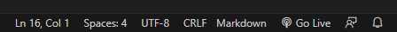

# World Bank - Education Inequality - VR

Este repositorio presenta un ambiente web de realidad virtual realizado con la herramienta BabiaXR para mostrar indicadores de educación provistos por bases de datos públicas del Banco Mundial. 

## Instrucciones para ejecutar el ambiente.

1. Descargar el repositorio:

    ```
    git clone https://github.com/LD9797/wbvr.github.io.git
    ```

2. Abrir el código descargado con VSCode.
3. Apretar el botón Go Live ubicado en la esquiena inferior derecha de VSCode: 
    

Del mismo modo, se puede accesar al link público [https://ld9797.github.io/wbvr.github.io/](https://ld9797.github.io/wbvr.github.io/).
